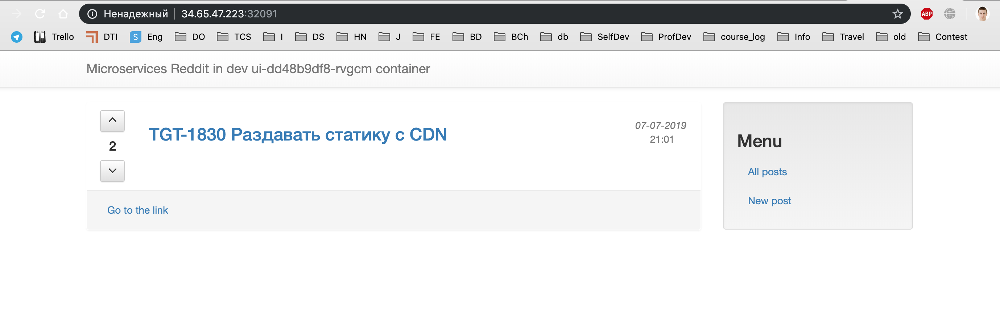

# alexyakovlev90_microservices


### ДЗ docker-1
#### Технология контейнеризации. Введение в Docker

1) Познакомились с Докером
2) Прикрутили Travis CI
3) Посмотрели результаты выполнения основных комманд Докера
4) Описали разницу между контейнером и образом с помощью команды `docker inspect`


### ДЗ docker-2
#### Docker контейнеры. Docker под капотом
Запуск VM с установленным Docker Engine при помощи Docker Machine. 
Написание Dockerfile и сборка образа с тестовым приложением. Сохранение образа на DockerHub.
1) Создание Docker-хоста в GCP
```bash
export GOOGLE_PROJECT=_project_name_ 

docker-machine create --driver google \
    --google-machine-image https://www.googleapis.com/compute/v1/projects/ubuntu-os-cloud/global/images/family/ubuntu-1604-lts \
    --google-machine-type n1-standard-1 \
    --google-zone europe-west1-b \
    docker-host 
docker-machine ls
```
2) Работа с Docker-хостом
```bash
eval $(docker-machine env docker-host)
```

3) PID namespace (изоляция процессов)
    - запускаем контейнер `docker run --rm -it ubuntu:latest bash`
    - запускаем процесс внутри контейнера `sleep 1000 &`
    - смотрим PID процесса внутри контейнера и наследование процесса на хосте `ps auxf`

4) net namespace (изоляция сети) 
    - запускаем контейнер
    - проверяем наличие интерфейса сети внутри контейнера `ifconfig`
    - проверяем на хосте виртуальный интерфейс контейнера `brctl show docker0` соотносим с общим списком `ifconfig`

5) user namespaces (изоляция пользователей) 
    - UID и GID внутри контейнеров отображаются в другом диапазоне UID и GID
    - https://docs.docker.com/engine/security/userns-remap/

6) Просмотр PID процессов хостовой системы
    - только процессы контейнера `docker run --rm -ti tehbilly/htop`
    - процессы хостовой системы `docker run --rm --pid host -ti tehbilly/htop`

7) Установка файрволла в GCP
```bash
gcloud compute firewall-rules create reddit-app \
    --allow tcp:9292 \
    --target-tags=docker-machine \
    --description="Allow PUMA connections" \
    --direction=INGRESS
```
##### Задания со *
1) Поднятие инстансов с помощью Terraform, их количество задается переменной

2) Несколько плейбуков Ansible с использованием динамического
   инвентори для установки докера и запуска там образа приложения
   - для установки докера использована роль: https://github.com/nickjj/ansible-docker
   - для запуска докер контейнера приложения роль `container-app` 
   с предустановкой `docker-py` и `docker-compose`
   
3) Шаблон пакера, который делает образ с уже установленным Docker   
   
   
### ДЗ docker-3
#### Docker-образы. Микросервисы  
Линтер для написания докерфайлов
- https://github.com/hadolint/hadolint

1) Сборка образов с сервисами
```bash
    docker build -t alexyakovlev90/post:1.0 ./post-py
    docker build -t alexyakovlev90/comment:1.0 ./comment
    docker build -t alexyakovlev90/ui:1.0 ./ui
```
* для запуска без ошибок alexyakovlev90/post:1.0 билда 
в начало python скрипта запуска был добавлен **shebang** 
(https://stackoverflow.com/questions/55271912/flask-cli-throws-oserror-errno-8-exec-format-error-when-run-through-docker)
* для имаджей `alexyakovlev90/ui:1.0` и `alexyakovlev90/comment:1.0 `
для коректной сборки руби был явно указан репозиторий командой:
```bash
printf "deb http://archive.debian.org/debian/ jessie main\ndeb-src http://archive.debian.org/debian/ jessie main\ndeb http://security.debian.org jessie/updates main\ndeb-src http://security.debian.org jessie/updates main" > /etc/apt/sources.list
```

2) Создали bridge-сеть для контейнеров, так как сетевые алиасы не работают в сети по умолчанию
```bash
    docker network create reddit
```

3) Запуск контейнеров в созданной сети с алиасами
    Сетевые алиасы могут быть использованы для сетевых соединений, как доменные имена
```bash
docker run -d --network=reddit \
    --network-alias=post_db --network-alias=comment_db mongo:latest
docker run -d --network=reddit \
    --network-alias=post alexyakovlev90/post:1.0
docker run -d --network=reddit \
    --network-alias=comment alexyakovlev90/comment:1.0
docker run -d --network=reddit \
    -p 9292:9292 alexyakovlev90/ui:1.0
```
4) После изменения исходного образа Dockerfile сервиса UI
с `ruby:2.2` на `ubuntu:16.04` размер имаджа снизился почти в 2 раза
```bash
docker build -t alexyakovlev90/ui:2.0 ./ui
```
5) Доп заданием образы, наследуемые от ruby:2.2 были
собраны на основе Alpine Linux. Это существенно уменьшело их размер

6) Монтирование volume к БД
```bash
docker volume create reddit_db
docker run -d --network=reddit --network-alias=post_db \
    --network-alias=comment_db -v reddit_db:/data/db mongo:latest
```


### ДЗ docker-4
#### Docker: сети, docker-compose
1) Запустим контейнер с использованием none-драйвера.
   В качестве образа используем joffotron/docker-net-tools,
   его состав уже входят необходимые утилиты для работы с сетью: пакеты bindtools, net-tools и curl. 
```bash
docker run -ti --rm --network none joffotron/docker-net-tools -c ifconfig
```
Контейнер запустится, выполнить команду `ifconfig` и будет удален (флаг --rm)
Можно запускать сетевые сервисы внутри такого контейнера, но лишь для локальных
экспериментов (тестирование, контейнеры для выполнения разовых задач и т.д.)

2) Запустим контейнер в сетевом пространстве docker-хоста
```bash
docker run -ti --rm --network host joffotron/docker-net-tools -c ifconfig
```
вывод команды практически идентичен `docker-machine ssh docker-host ifconfig`

3) Повторите запуски контейнеров с использованием драйверов
none и host и посмотрите, как меняется список namespace.
Для просмотра net-namespaces с помощью команды `sudo ip netns`
На docker-host машине выполните команду: 
```bash
 sudo ln -s /var/run/docker/netns /var/run/netns
```
- При запуске контейнера с использованием none-драйвера 
для каждого нового контейнера создается дополнительный namespace

- При запуске контейнера с использованием host-драйвера сети
контейнер будет использовать default namespace

4) Создадим bridge-сеть в docker (флаг --driver указывать не обязательно, по-умолчанию используется bridge)
```bash
 docker network create reddit --driver bridge
```
Запуск приложений в сети с использованием алиасов,
чтобы обращаться по dns-именам, прописанным в ENV-переменных
```bash
docker run -d --network=reddit --network-alias=post_db --network-alias=comment_db mongo:latest
docker run -d --network=reddit --network-alias=post alexyakovlev90/post:1.0
docker run -d --network=reddit --network-alias=comment alexyakovlev90/comment:1.0
docker run -d --network=reddit -p 9292:9292 alexyakovlev90/ui:1.0
```

5) Запуск проекта в 2х bridge сетях
```bash
> docker network create back_net --subnet=10.0.2.0/24
> docker network create front_net --subnet=10.0.1.0/24
```
Docker при инициализации контейнера может подключить к нему только 1 сеть
Подключим контейнеры ко второй сети
```bash
> docker network connect front_net post
> docker network connect front_net comment 
```

6) Собрать и запустить образы приложения reddit с помощью docker-compose 
с множеством сетей и параметризированных переменных окружений
```bash
> docker-compose up -d
> docker-compose ps
```
Имя проекта задано с помощью переменной окружения
COMPOSE_PROJECT_NAME=dockermicroservices
и указано в .env файле (https://docs.docker.com/compose/environment-variables/)


### ДЗ gitlab-ci-1
#### Устройство Gitlab CI. Построение процесса непрерывной поставки

1) Создали в Google Cloud новую мощную виртуальную машину
```bash
docker-machine create --driver google \
    --google-machine-image https://www.googleapis.com/compute/v1/projects/ubuntu-os-cloud/global/images/family/ubuntu-1604-lts \
    --google-machine-type n1-standard-1 \
    --google-zone europe-west1-b \
    --google-tags allow-http,allow-https \
    --google-disk-size 100 \
    gitlab-host

eval $(docker-machine env gitlab-host)
```
* рекомендуемые характеристики сервера https://docs.gitlab.com/ce/install/requirements.html
* Аргументы создания ВМ в docker-machine https://docs.docker.com/machine/drivers/gce/

2) Разворачиваем GitLab (описание в docker-compose.yml)

3) Создаем группу/проект в гитлабе и CI/CD Pipeline в .gitlab-ci.yml
```bash
git checkout -b gitlab-ci-1

git remote add gitlab http://35.205.70.101/homework/example.git
git push gitlab gitlab-ci-1
```
4) Создаем и добавляем Runner для запуска pipeline
```bash
docker run -d --name gitlab-runner --restart always \
    -v /srv/gitlab-runner/config:/etc/gitlab-runner \
    -v /var/run/docker.sock:/var/run/docker.sock \
    gitlab/gitlab-runner:latest
```
- регистрируем Runner в Gitlab
```bash
docker exec -it gitlab-runner gitlab-runner register --run-untagged --locked=false
```
```
Please enter the gitlab-ci coordinator URL (e.g. https://gitlab.com/):
> http://<YOUR-VM-IP>/
Please enter the gitlab-ci token for this runner:
> <TOKEN>
Please enter the gitlab-ci description for this runner:
> my-runner
Please enter the gitlab-ci tags for this runner (comma separated):
> linux,xenial,ubuntu,docker
Please enter the executor:
> docker
Please enter the default Docker image (e.g. ruby:2.1):
> alpine:latest
Runner registered successfully.
```

5) Добавили стадию тестирования/ревью в pipeline, окружения 
6) В шаг build добавили сборку контейнера с приложением reddit 
7) Добавили Деплой контейнера с reddit на созданный для ветки сервер.


### ДЗ monitoring-1
#### Введение в мониторинг. Системы мониторинга.

1) Создали правило фаервола для Prometheus и Puma:
```bash
gcloud compute firewall-rules create prometheus-default --allow tcp:9090
gcloud compute firewall-rules create puma-default --allow tcp:9292 
```
2) Создание Docker-хоста в GCP
```bash
docker-machine create --driver google \
   --google-machine-image https://www.googleapis.com/compute/v1/projects/ubuntu-os-cloud/global/images/family/ubuntu-1604-lts \
   --google-machine-type n1-standard-1 \
   --google-zone europe-west1-b \
   docker-host 

eval $(docker-machine env docker-host)
```   

3) Установили Систему мониторинга Prometheus
```bash
docker run --rm -p 9090:9090 -d --name prometheus prom/prometheus:v2.1.0
```

4) Добавили мониторинг ВМ в docker-compose.yml
- https://github.com/prometheus/node_exporter

5) Запушили сервисы в Docker Hub 
- https://cloud.docker.com/repository/docker/alexyakovlev90
```bash
docker push alexyakovlev90/ui
docker push alexyakovlev90/comment
docker push alexyakovlev90/post
docker push alexyakovlev90/prometheus 
```


### ДЗ monitoring-2
#### Мониторинг приложения и инфраструктуры

`docker-compose up -d` - запуск приложения
`docker-compose -f docker-compose-monitoring.yml up -d` - запуск мониторинга

1) Мониторинг Docker контейнеров
- https://github.com/google/cadvisor

2) Визуализация метрик
- https://grafana.com/dashboards

3) Сбор метрик работы приложения и бизнес метрик
- поиск всех http запросов, у которых код возврата начинается либо с 4 либо с 5
```
rate(ui_request_count{http_status=~"^[45].*"}[1m])
```

4) Настройка и проверка алертинга
- prom/alertmanager:v0.14.0


### ДЗ logging-1
#### Логирование и распределенная трассировка

1) Сбор неструктурированных логов
- GCE docker machine 
```bash
docker-machine create --driver google \
    --google-machine-image https://www.googleapis.com/compute/v1/projects/ubuntu-os-cloud/global/images/family/ubuntu-1604-lts \
    --google-machine-type n1-standard-1 \
    --google-open-port 5601/tcp \
    --google-open-port 9292/tcp \
    --google-open-port 9411/tcp \
    logging
```
35.224.139.91

- Логирование Docker контейнеров  
    - Для отправки логов во Fluentd используем docker драйвер
    https://docs.docker.com/config/containers/logging/fluentd/

2) Визуализация логов
- Для визуализации используется Kibana
- Необходимо задать индекс `fluentd-*`

3) Сбор структурированных логов
- Для парсинга логов использовались:
    - регулярные выражения
    - grok-шаблоны - именованные шаблоны регулярных выражений

4) Распределенная трасировка


### ДЗ kubernetes-1
#### Введение в Kubernetes

- Ручная установка кластера k8s: https://github.com/kelseyhightower/kubernetes-the-hard-way


### ДЗ kubernetes-2
#### Kubernetes. Запуск кластера и приложения. Модель безопасности.

- Развернуть локальное окружение для работы с Kubernetes
- Развернуть Kubernetes в GKE
- Запустить reddit в Kubernetes



- Панель управления:  
http://localhost:8001/api/v1/namespaces/kube-system/services/https:kubernetes-dashboard:/proxy

- назначим роль cluster-admin service account-у dashboard-а
```bash
kubectl create clusterrolebinding kubernetes-dashboard \
    --clusterrole=cluster-admin \
    --serviceaccount=kube-system:kubernetes-dashboard
```


### ДЗ kubernetes-3
#### Kubernetes. Networks, Storages
1) Деплой проекта в k8s
- создаем кластер
```bash
gcloud container clusters create reddit-cluster \
    --machine-type n1-standard-1 \
    --num-nodes 3 \
    --disk-size 100 \
    --no-enable-autoupgrade \
    --project otus-fp
```
-  добавить кластер в файл ~/.kube/config
```bash
gcloud container clusters get-credentials reddit-cluster \
    --zone europe-west4-b \
    --project otus-fp
```
- установить контекст
```bash
kubectl config use-context CONTEXT_NAME
# to list all contexts:
kubectl config get-contexts
```
- развернуть проект
```bash
kubectl apply -f ./kubernetes/reddit/dev-namespace.yml
kubectl apply -f ./kubernetes/reddit/ -n dev
```
- Откроем диапазон портов kubernetes для публикации сервисов

2) Настройка доступа по HTTPS для ingress
- Защитим наш сервис с помощью TLS
```bash
# get Ingress IP
kubectl get ingress -n dev
# Далее подготовим сертификат используя IP как CN
openssl req -x509 -nodes -days 365 -newkey rsa:2048 -keyout tls.key -out tls.crt -subj "/CN=34.98.104.85" 
# И загрузит сертификат в кластер kubernetes
kubectl create secret tls ui-ingress --key tls.key --cert tls.crt -n dev
# Проверить можно командой
kubectl describe secret ui-ingress -n dev
```
- Теперь настроим Ingress на прием только HTTPS траффика: ui-ingress.yml
```yaml
apiVersion: extensions/v1beta1
kind: Ingress
metadata:
  name: ui
  # Отключаем проброс HTTP
  annotations:
    kubernetes.io/ingress.allow-http: "false"
spec:
  # Подключаем наш сертификат
  tls:
    - secretName: ui-ingress
  backend:
    serviceName: ui
    servicePort: 9292
```
3) Ограничение трафика с помощью NetworkPolicy
- ограничить трафик, поступающий на mongodb отовсюду, кроме сервисов post и comment.
  Для NetworkPolicy отдельно будет включен сетевой плагин Calico (вместо Kubenet).
```bash
# Найдите имя кластера
gcloud beta container clusters list
# Включим network-policy для GKE.
gcloud beta container clusters update reddit-cluster --zone=europe-west4-b --update-addons=NetworkPolicy=ENABLED
gcloud beta container clusters update reddit-cluster --zone=europe-west4-b  --enable-network-policy
```

4) Хранилище для базы
- Создадим диск в Google Cloud
```bash
gcloud compute disks create --size=25GB --zone=europe-west4-b reddit-mongo-disk
```
- Добавим новый Volume POD-у базы
```yaml
volumeMounts:
 - name: mongo-gce-pd-storage
  mountPath: /data/db
volumes:
- name: mongo-gce-pd-storage
  gcePersistentDisk:
    pdName: reddit-mongo-disk
    fsType: ext4
```
- PersistentVolume, PersistentVolumeClaim, StorageClass


### ДЗ kubernetes-4
#### CI/CD в Kubernetes
1) Работа с Helm
- установка
```bash
brew install kubernetes-helm
```
or https://github.com/kubernetes/helm/releases - распакуйте и разместите исполняемый 
файл helm в директории исполнения (/usr/local/bin/ , /usr/bin, …)
- Установим серверную часть Helm’а - Tiller (аддон Kubernetes, т.е. Pod, который общается с API Kubernetes)
Для этого понадобится ему выдать ServiceAccount и назначить роли RBAC, 
необходимые для работы (manifest tiller.yml).
```bash
kubectl apply -f tiller.yml
# Теперь запустим tiller-сервер
helm init --service-account tiller
# Check
kubectl get pods -n kube-system --selector app=helm
```

2) Развертывание Gitlab в Kubernetes
```bash
helm install --name ui-1 ui/
helm upgrade ui-1 ui/
# загрузить зависимости
helm dep update ./reddit
# Поиск чарта
helm search mongo

# Установка приложения
helm install reddit --name reddit-test

# Обновите релиз, установленный в k8s
helm upgrade reddit-test ./reddit

# remove all releases
helm ls --all --short | xargs -L1 helm delete --purge
```
Здесь мы используем встроенные переменные
```
name: {{ .Release.Name }}-{{ .Chart.Name }}
.Release - группа переменных с информацией о релизе (конкретном запуске Chart’а в k8s)
.Chart - группа переменных с информацией о Chart’е (содержимое файла Chart.yaml)

.Template - информация о текущем шаблоне ( .Name и .BasePath)
.Capabilities - информация о Kubernetes (версия, версии API)
.Files.Get - получить содержимое файла
```

3) Запуск CI/CD конвейера в Kubernetes. Подготовка
- Подготовим GKE-кластер. Нам нужны машинки помощнее.
```bash
gcloud container node-pools create bigpool \
      --cluster reddit-cluster \
      --machine-type n1-standard-2 \
      --num-nodes 1 \
      --disk-size 40 \
      --no-enable-autoupgrade \
      --project otus-fp
gcloud container node-pools list --cluster reddit-cluster
gcloud container node-pools describe [POOL_NAME] \
    --cluster reddit-cluster
```
+ вкл. устаревшие права доступа

- Добавим репозиторий Gitlab
```bash
helm repo add gitlab https://charts.gitlab.io
```
- Мы будем менять конфигурацию Gitlab, поэтому скачаем Chart
```bash
helm fetch gitlab/gitlab-omnibus --version 0.1.37 --untar
cd gitlab-omnibus
```

4) Установим GitLab
- Поправьте `gitlab-omnibus/values.yaml`
```yaml
baseDomain: example.com
legoEmail: you@example.com
```
- Добавьте в `gitlab-omnibus/templates/gitlab/gitlab-svc.yaml`
```yaml
- name: web
  port: 80
  targetPort: workhorse
```
- Поправить в `gitlab-omnibus/templates/gitlab-config.yaml`
```yaml
data:
  external_scheme: http
  external_hostname: {{ template "fullname" . }}
```
- Поправить в `gitlab-omnibus/templates/ingress/gitlab-ingress.yaml`
...
```bash
helm install --name gitlab . -f values.yaml
# Найдите выданный IP-адрес ingress-контроллера nginx.
kubectl get service -n nginx-ingress nginx

# Поместите запись в локальный файл /etc/hosts (поставьте свой IP-адрес)
echo "34.90.114.198 gitlab-gitlab staging production" >> /etc/hosts

```


